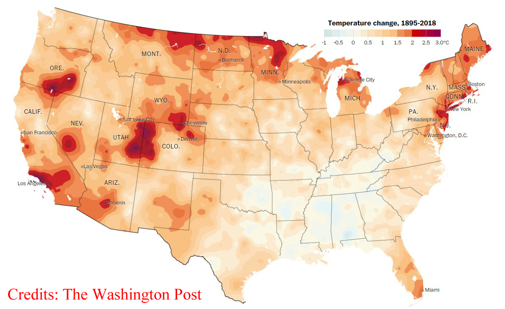

My research focuses on environmental migration including government-led planned relocation and individual migration because of slow- and rapid-onset environmental change. My research goals are to: (1) identify the hotspots of environmental changes and populations who are affected by such changes; (2) to determine the pathways through which environmental changes trigger migration; (3) to evaluate the impacts of environmental migration on a series of developmental indicators such as economic well-being, educational attainment, and health in my future research.

 

#### Planned relocation

{: height="75px" width="300px" style="float:right; padding-left:20px"}

Government-led and subsidized relocation projects have been employed to tackle issues such as poverty, resource scarcity, and climate-induced disasters in many societies. Previous studies have focused mainly on relocation projects’ impacts on health, educational attainment, and other developmental indicators while neglecting systematic analysis of relocatees’ willingness to relocate and stability within the receiving community. Drawing on primary survey data collected from the Targeted Poverty Alleviation Project (TPAP) in China which involves relocations of 55 million population from resource-constrained and environmentally vulnerable areas to more economically developed and ecologically friendly regions in a five-year time span, this research investigates the factors associated with people’s willingness to relocate and their relocation stability measured by the frequency of visiting the place of origin. It advances our understanding of why and under what circumstances people relocate and stay at a relocation destination under a universal government subsidy. It also contributes to future government planning on developing and implementing relocation projects.

 

#### Environmental migration in the US

{: height="75px" width="300px" style="float:right; padding-left:10px"}

An estimate of about 200 million people will be displaced because of climate change by 2050. Although much work has been done in exploring the environment-migration linkages, a consensus of the effect of environmental factors on migration has not been widely accepted and the mechanisms remain unclear, particularly for slow-onset environmental variabilities such as precipitation and temperature anomaly whose effects are usually less sensitive to people involved and take a long time to unfold. This research theme investigates the impacts of temperature and precipitation variabilities on migration from longitudinal and spatial-temporal perspectives in the US using county-level migration data from the Internal Revenue Service (IRS) and climate data from the National Oceanic and Atmospheric Administration (NOAA).

 

