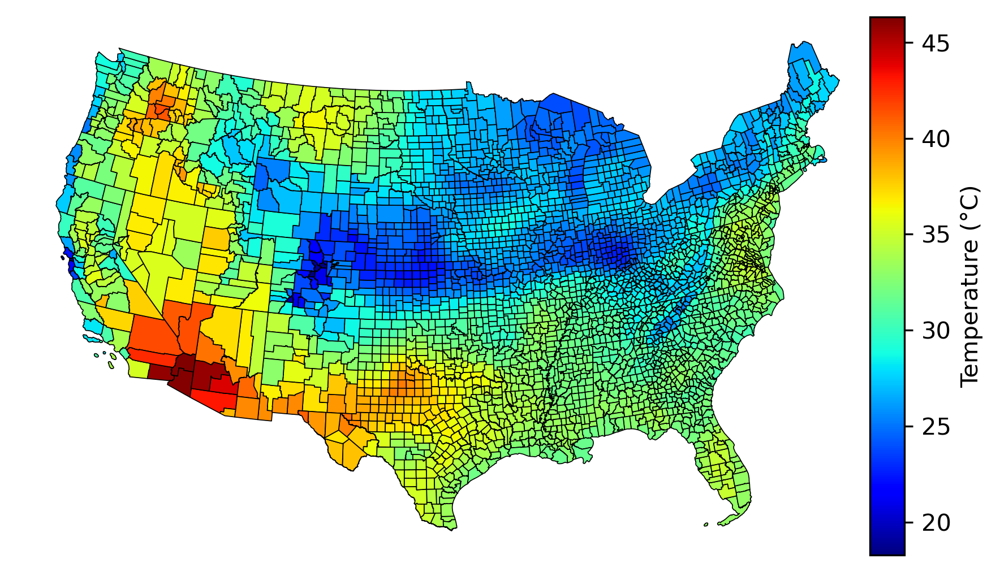

My research focuses on environmental migration including government-led planned relocation and individual migration because of slow- and rapid-onset environmental change. My research goals are to: (1) identify the hotspots of environmental changes and populations affected by such changes; (2) determine the pathways through which environmental changes trigger migration; (3) evaluate the environmental impacts on a series of demographic outcomes and developmental indicators such as economic well-being, educational attainment, and health in his future research.

 

#### Planned relocation in the era of climate change

{: height="75px" width="300px" style="float:right; padding-left:20px"}

Government-led and subsidized relocation projects have been employed to tackle issues such as poverty, resource scarcity, and climate-induced disasters in many societies. Previous studies have focused mainly on relocation projects’ impacts on health, educational attainment, and other developmental indicators while neglecting the systematic analysis of relocatees’ willingness to relocate and stability within the receiving community. Drawing on primary survey data collected from the Targeted Poverty Alleviation Project (TPAP) in China which involves relocations of 10 million population from resource-constrained and environmentally vulnerable areas to more economically developed and ecologically friendly regions in a five-year time span, this research investigates the factors associated with people’s willingness to relocate and their relocation stability measured by the frequency of visiting the place of origin. It advances our understanding of why and under what circumstances people relocate and stay at a relocation destination under a universal government subsidy. It also contributes to future government planning on developing and implementing relocation projects.

 

#### Environmental migration in the US

{: height="75px" width="300px" style="float:right; padding-left:10px"}

An estimate of about 200 million people will be displaced because of climate change by 2050. Although much work has been done in exploring the environment-migration linkages, a consensus on the effect of environmental factors on migration has not been widely accepted and the mechanisms remain unclear, particularly for slow-onset environmental variabilities such as precipitation and temperature anomalies whose effects are usually less sensitive to people involved and take a long time to unfold. This research theme investigates the impacts of temperature and precipitation variabilities on migration from longitudinal and spatial-temporal perspectives in the US across the last five decades (1970-2020) using data from multiple sources including the Net Migration Patterns for US Counties, decennial census, American Community Survey (ACS), Internal Revenue Service (IRS) and high-resolution climate data from the National Oceanic and Atmospheric Administration (NOAA) and Parameter-elevation Regressions on Independent Slopes Model (PRISM).

 

#### Open-source solutions to social science

{: height="75px" width="300px" style="float:right; padding-left:10px"}

Scientific research has been increasingly relying on big data and high performance computing (HPC), especially for environmental migration studies in which long-time environmental or climatic records across a county or the globe are involved. However, conventional non-programmable computer programs cannot be readily deployed to HPC platforms and are irreproducible to facilitate research procedures and open science. This research theme harnesses the computing capabilities of HPC platforms and open-source programming languages such as Python to social science. For instance, I developed <a href="https://gps2space.readthedocs.io/en/latest/index.html" target="_blank">GPS2space</a>, a Python library for constructing buffer- and convex hull-based activity space and shared space from raw GPS data or data with latitude and longitude coordinate pairs, and performing fast distance queries to user-specified landmarks. The open-source solution greatly enhances the replicability and reproducibility of social science research.

 

